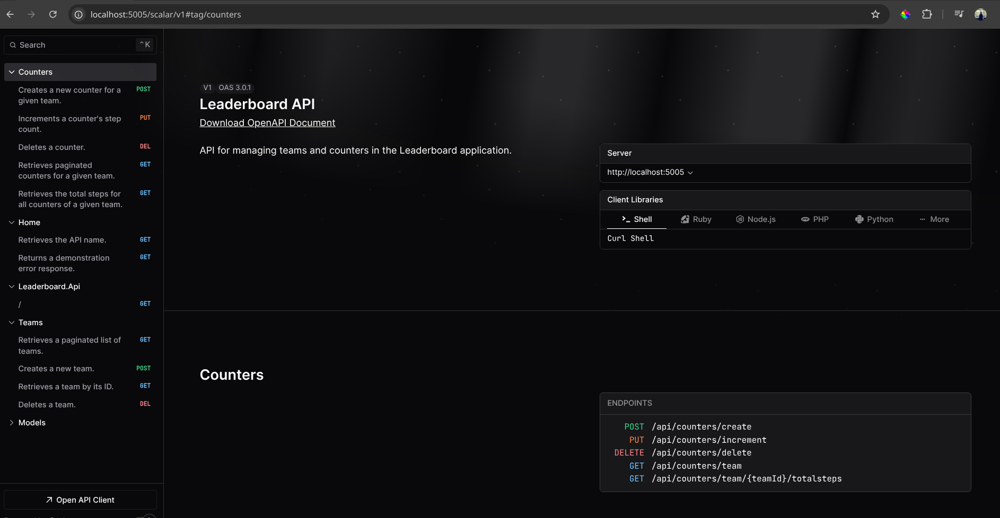
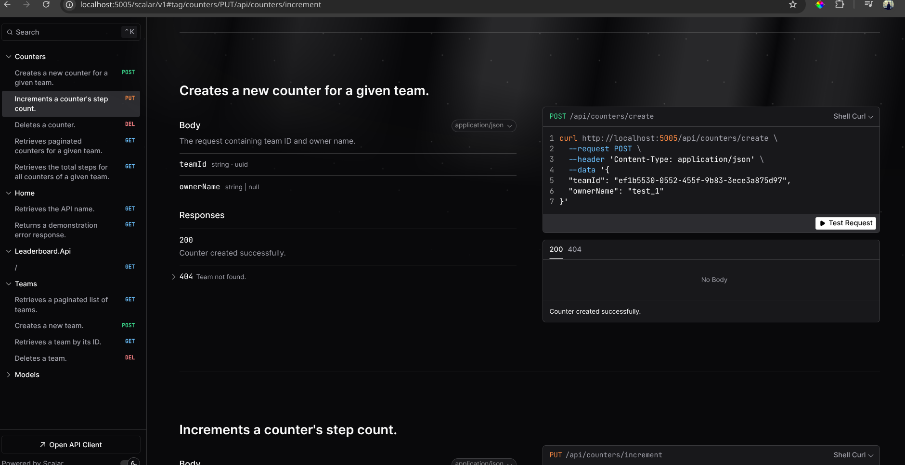
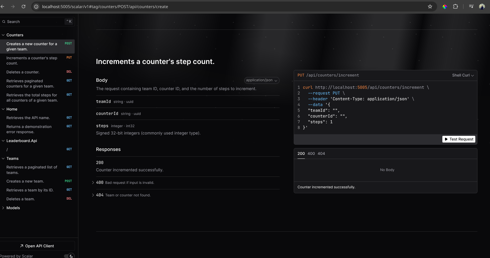
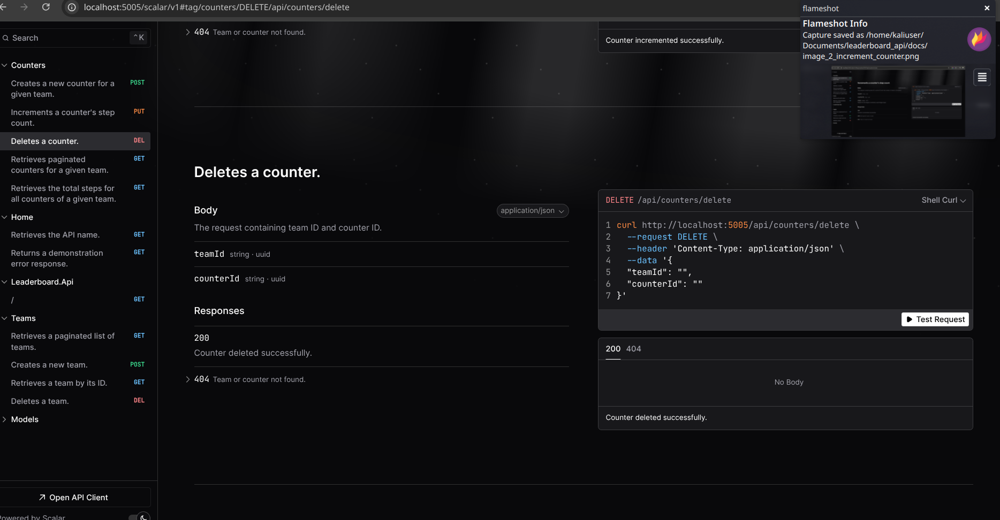
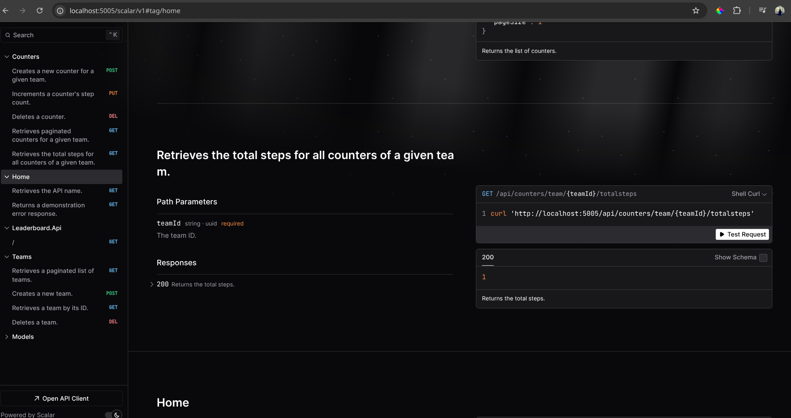
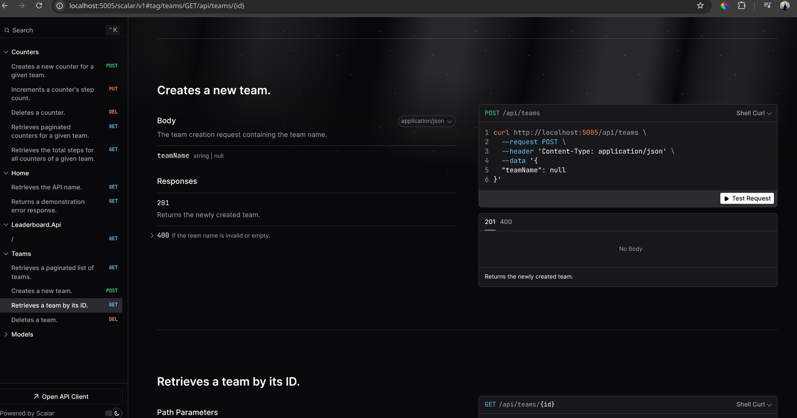
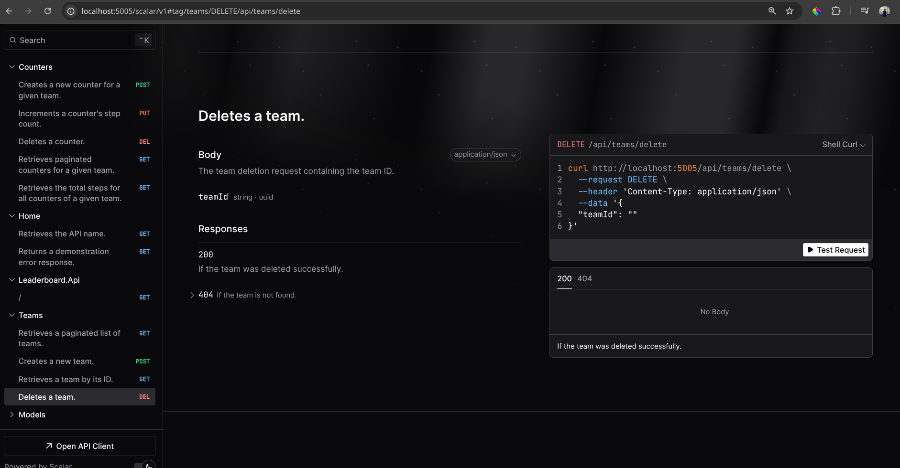
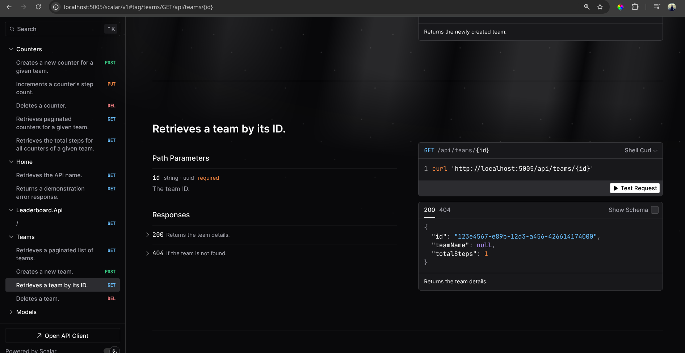
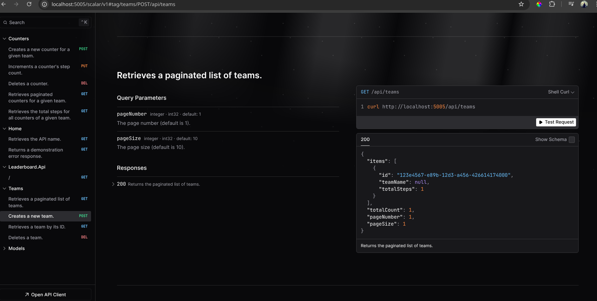
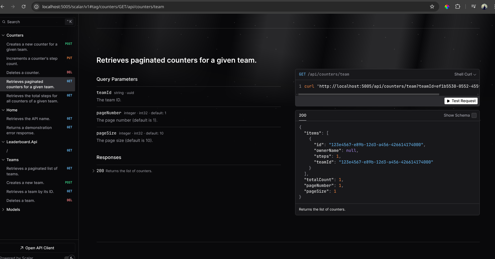

# Leaderboard API

This project is a CQRS hybrid and Domain-Driven Design (DDD) implementation of a company-wide steps leaderboard application for teams of employees. The API supports creating, incrementing, and deleting counters; adding and deleting teams; and retrieving step count information for teams and individual counters.

> **Note:**  
> - The API uses in-memory storage via Redis so that data is lost on shutdown. Redis is leveraged as a fast, in-memory data store.  
> - A rate limiter middleware is used to throttle incoming requests and ensure fair usage.  
> - API documentation is provided by Scalar and can be accessed at `/scalar/v1`.

## Table of Contents

- [Overview](#overview)
- [Architecture](#architecture)
- [User Stories](#user-stories)
- [Endpoints and Payloads](#endpoints-and-payloads)
- [Images](#images)
- [Running the Application Locally](#running-the-application-locally)
- [Running with Docker](#running-with-docker)
- [API Documentation with Scalar](#api-documentation-with-scalar)
- [Additional Considerations](#additional-considerations)
- [License](#license)

## Overview

The Leaderboard API is built with .NET (C#) and leverages a CQRS hybrid approach along with Domain-Driven Design principles. It separates commands (create, update, delete operations) from queries (data retrieval) and organizes the solution into multiple projects:
- `Leaderboard.Api` – The REST API project.
- `Leaderboard.Application` – Application presentation logic (commands, queries, events, services, services abstractions).
- `Leaderboard.Core` – Domain models and business rules, repository models.
- `Leaderboard.Infrastructure` – Infrastructure concerns including Redis integration, middleware exception/responces mappers, message broker service, possible monitoring services and external dependencies.

## Architecture

- **CQRS Hybrid:**  
  - *Commands* such as **CreateTeam** or **IncrementCounter** are processed by domain services.
  - *Queries* such as **GetAllTeamsQuery** or **GetTeamByIdQuery** are handled by dedicated query handlers.
  
- **Domain-Driven Design (DDD):**  
  The domain model encapsulates business rules through entities (e.g., **Team**, **Counter**) and value objects (e.g., **TeamName**, **StepCount**). This clean architecture enables clear separation between business logic, application logic, and infrastructure.

- **Redis Leveraging:**  
  Redis is used as an in-memory datastore for storing counters and team data. This approach is ideal for scenarios where persistence is not critical, and it offers high performance.

- **Rate Limiter Middleware:**  
  The API uses custom middleware to limit the number of requests per client IP within a specific time window. This ensures fair resource usage and prevents abuse.

## User Stories

The API was designed to address the following user stories:

1. **Counter Management:**
   - **Create a new counter:**  
     *As a user, I want to create a new counter for a team so that steps can be accumulated.*
   - **Increment a counter:**  
     *As a user, I want to increment a counter so that additional steps are counted towards my team's score.*
   - **Delete a counter:**  
     *As a user, I want to delete a counter to manage team members' counters.*

2. **Team Management:**
   - **Add a new team:**  
     *As a user, I want to add a new team to group employees together.*
   - **Delete a team:**  
     *As a user, I want to delete a team to manage team data.*
   - **List all teams:**  
     *As a user, I want to list all teams to compare step counts across teams.*
   - **Retrieve team details:**  
     *As a user, I want to view a specific team by its ID, including its total step count.*

3. **Data Retrieval:**
   - **List all counters in a team:**  
     *As a user, I want to view all counters for a team to see individual contributions.*
   - **Get total steps for a team:**  
     *As a user, I want to retrieve the total step count for a team.*

## Endpoints and Payloads

### **Counters**

- **POST `/api/counters/create`**  
  **Purpose:** Create a new counter for a team.  
  **Payload Example:**
  ```json
  {
    "teamId": "c4d7e8f2-1234-4abc-8d3e-1a2b3c4d5e6f",
    "ownerName": "John Doe"
  }
  ```  
  **Responses:**  
  - `200 OK`: "Counter created successfully."  
  - `404 Not Found`: "Team with ID {teamId} was not found."

- **PUT `/api/counters/increment`**  
  **Purpose:** Increment a counter's step count.  
  **Payload Example:**
  ```json
  {
    "teamId": "c4d7e8f2-1234-4abc-8d3e-1a2b3c4d5e6f",
    "counterId": "d5e6f7a8-2345-4bcd-9e0f-1b2c3d4e5f67",
    "steps": 1000
  }
  ```  
  **Responses:**  
  - `200 OK`: "Counter incremented successfully."  
  - `400 Bad Request`: If the input is invalid.  
  - `404 Not Found`: If the team or counter is not found.

- **DELETE `/api/counters/delete`**  
  **Purpose:** Delete a counter.  
  **Payload Example:**
  ```json
  {
    "teamId": "c4d7e8f2-1234-4abc-8d3e-1a2b3c4d5e6f",
    "counterId": "d5e6f7a8-2345-4bcd-9e0f-1b2c3d4e5f67"
  }
  ```  
  **Responses:**  
  - `200 OK`: "Counter deleted successfully."  
  - `404 Not Found`: If the team or counter is not found.

- **GET `/api/counters/team?teamId={teamId}&pageNumber={pageNumber}&pageSize={pageSize}`**  
  **Purpose:** Retrieve a paginated list of counters for a given team.  
  **Response Example:**
  ```json
  {
    "items": [
      {
        "id": "d5e6f7a8-2345-4bcd-9e0f-1b2c3d4e5f67",
        "teamId": "c4d7e8f2-1234-4abc-8d3e-1a2b3c4d5e6f",
        "ownerName": "John Doe",
        "steps": 1000
      }
    ],
    "totalCount": 1,
    "pageNumber": 1,
    "pageSize": 10
  }
  ```

- **GET `/api/counters/team/{teamId}/totalsteps`**  
  **Purpose:** Retrieve the total steps for all counters of a given team.  
  **Response Example:**
  ```json
  2500
  ```

### **Teams**

- **GET `/api/teams`**  
  **Purpose:** Retrieve a paginated list of all teams.  
  **Response Example:**
  ```json
  {
    "items": [
      {
        "id": "a1b2c3d4-5678-90ab-cdef-1234567890ab",
        "teamName": "Marketing",
        "totalSteps": 5000
      }
    ],
    "totalCount": 1,
    "pageNumber": 1,
    "pageSize": 10
  }
  ```

- **GET `/api/teams/{id}`**  
  **Purpose:** Retrieve details for a specific team by its ID.  
  **Response Example:**
  ```json
  {
    "id": "a1b2c3d4-5678-90ab-cdef-1234567890ab",
    "teamName": "Marketing",
    "totalSteps": 5000
  }
  ```  
  **Responses:**  
  - `200 OK`: Returns the team details.  
  - `404 Not Found`: If the team is not found.

- **POST `/api/teams`**  
  **Purpose:** Create a new team.  
  **Payload Example:**
  ```json
  {
    "teamName": "Marketing"
  }
  ```  
  **Responses:**  
  - `201 Created`: Returns the newly created team details.  
  - `400 Bad Request`: If the team name is empty or invalid.

- **DELETE `/api/teams/delete`**  
  **Purpose:** Delete an existing team.  
  **Payload Example:**
  ```json
  {
    "teamId": "a1b2c3d4-5678-90ab-cdef-1234567890ab"
  }
  ```  
  **Responses:**  
  - `200 OK`: "Team deleted successfully."  
  - `404 Not Found`: If the team is not found.

### **Home**

- **GET `/api/hello`**  
  **Purpose:** Retrieve the API name as a simple test endpoint.  
  **Response Example:**
  ```
  Leaderboard API
  ```

- **GET `/api/error`**  
  **Purpose:** Returns a demonstration error response.  
  **Response Example:**
  ```json
  {
    "code": "error",
    "message": "oops, it's seems the error appeared!"
  }
  ```

## Images

Below are some images that illustrate key aspects of the application:

- **Introduction:**  
  
- **Create Counter:**  
  
- **Increment Counter:**  
  
- **Delete Counter:**  
  
- **Retrieve Total Steps for Counters:**  
  
- **Create New Team:**  
  
- **Delete Team:**  
  
- **Retrieve Team:**  
  
- **Teams List:**  
  
- **Retrieve Counters for Team:**  
  

## Running the Application Locally

1. **Clone the repository** and navigate to its root directory (all the scripts below has to be input from the root directory of the repository).
2. **Run the infrastrucutre services (Redis)**
   ```bash
   cd scripts
   docker compose -f services.yml up -d
   ```
3. **Restore dependencies and run the API:**
   ```bash
   cd src/Leaderboard.Api
   dotnet run
   ```
4. The API will run on the default URL as configured in your launch settings (e.g., `http://localhost:5000`). You can adjust this via environment variables if needed.

## Running with Docker

There are two ways to run the application using Docker:

### 1. Running Both Infrastructure and API

The provided Docker Compose file in the `scripts` folder (named `infrastructure.yml`) runs both the Redis service and the Leaderboard API.

- **Steps:**
  1. Navigate to the `scripts` folder:
     ```bash
     cd scripts
     ```
  2. Build and run the containers:
     ```bash
     docker-compose -f infrastructure.yml up --build -d
     ```
  3. The API will be accessible at [http://localhost:5005](http://localhost:5005).  
     The environment variable `ASPNETCORE_URLS=http://+:5005` ensures that the API listens on port **5005**.
  4. Redis uses a tmpfs volume, so its data is ephemeral and is cleared on container restart.

### 2. Running Individual Services

Alternatively, you can use the `services.yml` (if provided) to run specific services for development or testing purposes.

## API Documentation with Scalar

Scalar is used instead of Swagger for API documentation. Once the API is running, navigate to:

```
http://localhost:5005/scalar/v1
```

This endpoint displays detailed documentation for all available endpoints, including request payloads and responses.

## Additional Considerations

- **Clean Architecture:**  
  The solution follows Clean Architecture principles by separating concerns into distinct layers (API, Application, Core, and Infrastructure). This modular design not only improves testability, maintainability, and scalability but also allows for easy extension. For example, authorization can be enhanced by integrating a token-based system that leverages an application context and user context (derived from correlation data in the HTTP request) to enforce role-based permissions. This modularity means you can swap out or extend components (like the repository or authentication modules) without affecting the rest of the system.

- **Rate Limiter Middleware:**  
  A custom rate limiter middleware controls the number of requests per client IP within a specific time window. This helps prevent abuse and ensures fair resource usage, making the API more resilient under heavy load.

- **Redis Leveraging:**  
  Currently, Redis is used as an in-memory datastore for high-performance caching and transient storage. The Docker configuration uses a tmpfs volume so that Redis data is automatically cleared upon container restart. In scenarios requiring persistence, the repository implementation could be extended to use Redis as a persistent store or be replaced with another technology.

- **Persistence:**  
  For production, a persistent storage layer is recommended to ensure data durability across restarts. Depending on the requirements, options include SQL Server, PostgreSQL, or NoSQL solutions. For instance, at scale, the repository layer could be extended to support PostgreSQL, while still leveraging Redis for caching and quick-access scenarios.

- **Fault Tolerance & Scalability:**  
  The API is designed with scalability and fault tolerance in mind. In high-load environments, you might leverage:
  - **Redis clusters:** For distributed caching and session management.
  - **Message queues:** To decouple components and ensure reliable command processing.
  - **Load balancers:** To distribute incoming requests across multiple API instances.
  This architecture can handle increases in teams, counters, and traffic (even for a global contest scenario), and adjustments to the persistence layer may be made to better suit large-scale demands.

- **Authentication & Authorization:**  
  The API can be extended with authentication middleware to restrict access to specific endpoints. Role-based permissions can be implemented by integrating token-based authentication (e.g., JWT) along with context-aware authorization that considers user identity and correlation context from the HTTP request. This enables fine-grained control over which users can update specific counters or perform certain operations.


## License

This project is licensed under the MIT License. See [LICENSE.md](LICENSE.md) for details.

---